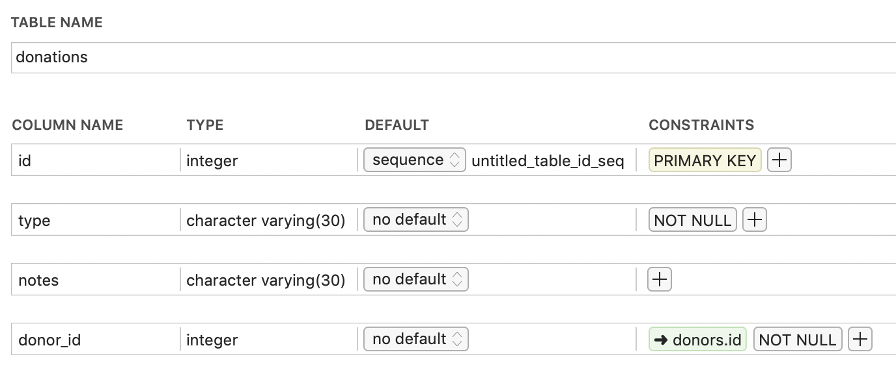
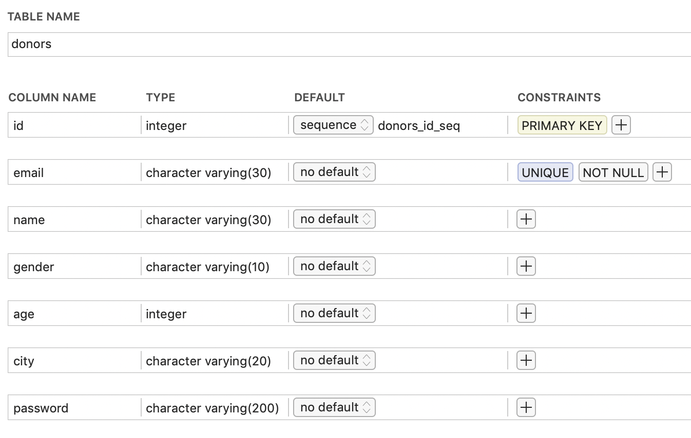
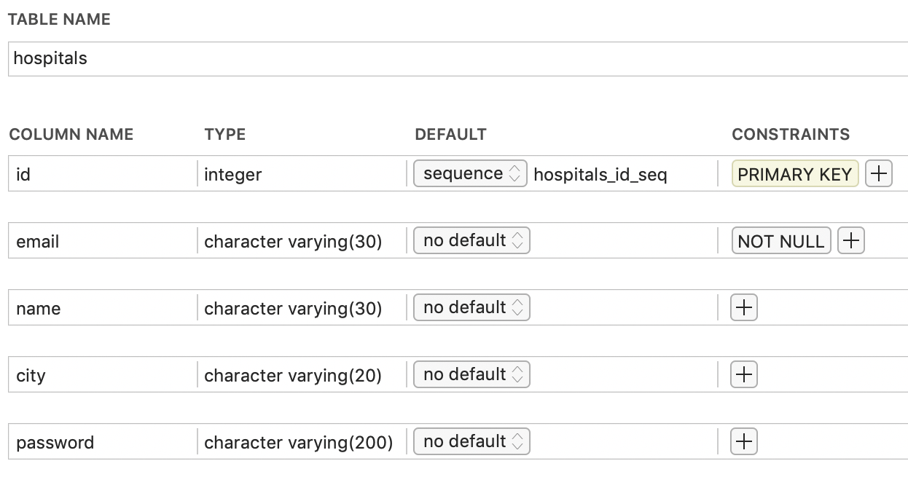

This is the backend side of the blood donation site

## Running locally

#### 1. Database setup

You should have a local postgres database with the following details

	port     = 5432
	user     = "postgres"
	password = "root"
	dbname   = "my_db"

Also you can edit them in `main.go` (line 17)

You should have three tables in the db, this is how each of them is structured
 
##### donations


##### donors


##### hospitals


#### 2. Installation & Development

Clone the repository
```shell
git clone https://github.com/ialmoqren/donation-go-api
```

Navigate to the project directory
```shell
cd donation-go-api
```

Run
```shell
go run main.go
```